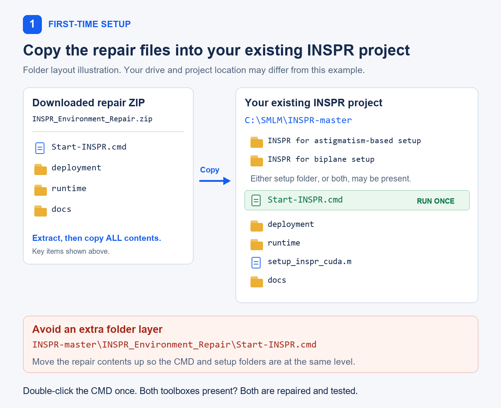
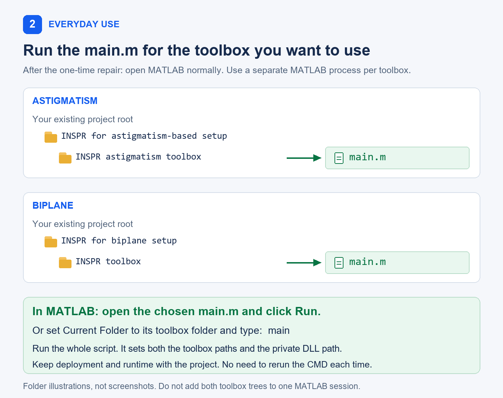

# INSPR 环境修复使用说明与原理

更新日期：2026 年 10 月 8 日  
适用项目：散光（astigmatism）与双平面（biplane）两套 INSPR 工具箱  
适用平台：Windows 64 位；本次实测系统为 Windows 11

**首次运行修复程序，完成后直接在 MATLAB 中运行项目的 `main.m`。日常使用不需要再次点击 `Start-INSPR.cmd`。**

GitHub 公开仓库：[Tailong-Chen/INSPR-Environment-Repair](https://github.com/Tailong-Chen/INSPR-Environment-Repair)  
完整修复包：[下载 INSPR_Environment_Repair.zip](https://github.com/Tailong-Chen/INSPR-Environment-Repair/releases/latest/download/INSPR_Environment_Repair.zip)

[English illustrated guide](INSPR_Environment_Guide_EN.md)

## 1. 这份修复包解决什么问题

运行 GPU 三维定位时，可能出现以下提示：

```text
Please install CUDA environment!
```

或者更具体的错误：

```text
MEX 文件 listGPUs.mexw64 无效：找不到指定的模块。
```

后一种错误不一定表示 `listGPUs.mexw64` 文件不存在，也可能是它依赖的 DLL 没有安装，或当前 MATLAB 进程找不到该 DLL。

本项目中的 `listGPUs.mexw64` 和三维定位程序 `cuda_ast_model.mexw64`（散光）/ `cuda_channel_specific_model.mexw64`（biplane）明确依赖 **`cudart64_75.dll`**，即 CUDA 7.5 的运行库，并依赖微软 VC++ 2013 x64 运行库。分割、重建等辅助程序还依赖 VC++ 2008/2010 x64 运行库。

因此，即使电脑已经安装新版 CUDA，也可能缺少这套旧程序需要的文件。修复包为现有编译程序提供匹配的运行库和加载路径。

## 2. 首次安装：只需操作一次

电脑应已安装可正常启动、授权可用的 **Windows 64 位 MATLAB**，以及适合本机 NVIDIA 显卡的驱动。修复包不安装 MATLAB、MATLAB 工具箱或显卡驱动。

1. 准备完整的 INSPR 项目，以及 `INSPR_Environment_Repair.zip`。修复 ZIP 是补充包，不包含完整项目和实验数据。
2. 在资源管理器中先解压 ZIP，打开解压出来的文件夹，按 `Ctrl+A` 选择里面的**全部内容**，复制到已有的 INSPR 项目根目录。所谓根目录，是已经包含 `INSPR for astigmatism-based setup`、`INSPR for biplane setup` 之一或两者的那一层。不要把整个解压文件夹再套进项目里，也不要放到工具箱子目录。

   

   图中的 `C:\SMLM\INSPR-master` 只是示例，可以换成你自己项目所在的位置。复制完成后，目录应类似：

   ```text
   INSPR-master/
   ├─ INSPR for astigmatism-based setup/  ← 若已安装
   ├─ INSPR for biplane setup/            ← 若已安装
   ├─ Start-INSPR.cmd
   ├─ setup_inspr_cuda.m
   ├─ INSPR_Environment_Guide.md
   ├─ deployment/
   └─ runtime/
      └─ win64/
         └─ cudart64_75.dll
   ```

3. 双击 `Start-INSPR.cmd`。若缺少微软运行库，程序会调用附带的官方安装器；出现 Windows 管理员权限提示时，允许安装。
4. 等待环境检查和小规模 GPU 定位测试。首次加载 GPU 内核可能需要一些时间。每套已检测到的工具箱都在独立 MATLAB 进程中测试。通过后打开 MATLAB；两套都有时，会弹出选择框让你选择要打开哪一套。缺少另一套工具箱不影响已有工具箱的修复。

控制台出现以下文字表示该次验证通过：

```text
PASS: all selected INSPR toolboxes ran their own GPU localization MEX successfully.
One-time setup complete. In future, open MATLAB normally and run the project main.m.
```

程序按需安装缺少的微软运行库，不要求安装完整 CUDA Toolkit、Visual Studio 或 Python。已有新版 CUDA 可以保留。若微软安装器明确要求重启 Windows，按提示重启后再运行一次修复程序。

## 3. 以后怎样打开项目

正常打开 MATLAB，将当前文件夹切换到：

```text
散光：INSPR-master/INSPR for astigmatism-based setup/INSPR astigmatism toolbox
biplane：INSPR-master/INSPR for biplane setup/INSPR toolbox
```



在命令窗口输入：

```matlab
main
```

也可以打开这个目录中的 `main.m`，点击“运行”执行整个脚本。随后按原来的流程导入数据、生成模型和运行定位。

请使用 **`main.m` 作为入口**。直接调用 `INSPR_ast_GUI` 或 `INSPR_GUI`，或者只执行 `main.m` 的最后一个代码节，可能绕过开头的自动配置。保留项目中的 `deployment` 和 `runtime` 文件夹；移动项目时应移动整个文件夹。

**两套工具箱请分别使用独立的 MATLAB 进程。** 它们包含同名函数、类和 GUI 全局变量。修复程序只配置选中的那一套；同一会话切换另一套时会明确拒绝，避免调用混乱。切换时另开 MATLAB，或保存结果后重启。不要对整个项目使用 `addpath(genpath(...))`。

只修复和测试指定的一套，可在项目根目录 PowerShell 中运行：

```powershell
.\Start-INSPR.cmd -Toolbox biplane
.\Start-INSPR.cmd -Toolbox astigmatism
```

默认自动检查所有已存在的工具箱；加 `-NoLaunch` 可只验证而不打开交互 GUI。旧版修复包用户：覆盖复制新版修复文件后运行 CMD 一次，即可备份并升级原有配置块。

## 4. 为什么运行一次后就不用再点击 CMD

需要区分两个概念：**保存一次启动配置**，以及**每次启动自动设置运行环境**。

### 首次修复做了什么

`Start-INSPR.cmd` 调用项目内的 PowerShell 脚本，依次执行：

1. 校验附带 NVIDIA DLL 和 Microsoft 安装器的 SHA-256、发布者数字签名。
2. 查找 MATLAB，检查 NVIDIA 驱动，按需安装旧版 VC++ x64 运行库。
3. 在已有的 `main.m` 开头加入自动配置代码，并把原文件备份到 `deployment/backups`。重复运行不会重复插入配置。
4. 在独立 MATLAB 进程中测试直接运行 `main.m`，再实际调用分割、重建和三维 GPU 定位程序。测试使用合成数据，不读取实验数据。

### 每次运行 main.m 做了什么

新增的入口代码调用 `deployment/inspr_prepare_runtime.m`。它根据项目所在位置，找到 `runtime/win64`，把这个目录加入**当前 MATLAB 进程的 PATH 环境变量**，同时配置对应工具箱及其 Support 的 MATLAB 搜索路径。

PATH 可以理解为 Windows 查找 DLL 时使用的目录列表之一。这样，当 MATLAB 加载项目的 MEX 程序时，Windows 就可以在该目录找到 `cudart64_75.dll`。

```text
运行 main.m
    → 自动配置当前 MATLAB 的 DLL 搜索路径
    → 打开 INSPR 界面
    → 运行定位时加载 MEX 及其依赖的 CUDA DLL
    → 通过现有 NVIDIA 驱动执行 GPU 运算
```

**永久保留的是 `main.m` 中的自动配置代码。** 关闭 MATLAB 后，该进程的临时 PATH 随之结束；下次运行 `main.m` 时会自动重新设置。因此，日常使用不用再手动配置，也不用再次点击 CMD。

自动配置不修改系统 PATH 或用户 `startup.m`，不写死 MATLAB 的安装位置，不重编译或替换定位 MEX。原有定位算法保持不变。首次修复中的 VC++ 运行库安装会保留在系统中。

### 为什么“装了新 CUDA”仍然不够

| 组件 | 在这里的作用 |
|---|---|
| MATLAB | 执行 `.m` 脚本、显示界面、调用 MEX |
| `.mexw64` | 已经编译好的程序，声明了所需的 DLL 依赖 |
| CUDA 运行库 DLL | 为编译好的 GPU 程序提供运行时支持；本项目主要需要 `cudart64_75.dll` |
| CUDA Toolkit | 开发、编译 CUDA 程序所用的工具和库；运行现有 MEX 通常无需安装整套工具链 |
| NVIDIA 驱动 | 为 GPU 程序提供与显卡交互的底层支持 |

旧 MEX 需要指定名称和版本的 DLL。安装新版 Toolkit 不等于同时安装了所有旧运行库，驱动向后兼容也不等于自动提供这些文件。不能把新版 CUDA DLL 改名为 `cudart64_75.dll` 来替代它。[NVIDIA 兼容性说明](https://docs.nvidia.com/deploy/cuda-compatibility/why-cuda-compatibility.html)区分了驱动兼容性与应用所需动态库。

## 5. 不同 MATLAB 版本怎样处理

自动配置代码使用当前运行的 MATLAB，不绑定 R2024a 或某个固定安装目录。但**路径配置成功，不代表旧 MEX 与所有 MATLAB 版本都兼容**。

修复程序默认尝试选择本机较新的 MATLAB。若安装了多个版本，或安装位置特殊，可在项目根目录打开 PowerShell，指定要验证的版本：

```powershell
.\Start-INSPR.cmd -MatlabExe "D:\MATLAB\R2024a\bin\matlab.exe"
```

把示例路径替换为自己要使用的 `matlab.exe`。更换 MATLAB 版本后，建议针对该版本做一次验证；通过后，该版本也直接运行项目的 `main.m`。

| 验证项目 | 截至 2026-10-08 的状态 |
|---|---|
| Windows 11 + MATLAB R2024a + RTX 3060 Ti，驱动 591.86 | 两套工具箱均已通过 GUI、分割、重建和各自三维 GPU 合成数据测试 |
| 不继承启动器 PATH，直接运行修改后的 `main.m` | 已通过 |
| 修复包解压到包含中文和空格的路径 | 已通过仅散光、仅 biplane、两者都有三种布局的首次配置和 GPU 验证 |
| 其他 MATLAB 版本 | 未在本机实测，需在对应版本中验证 |
| RTX 2080 Ti | 尚未现场实测，由接收方运行修复程序验证 |

根据 [MathWorks 的 MEX 兼容性说明](https://www.mathworks.com/help/matlab/matlab_external/version-compatibility.html)，旧版本生成的 MEX 通常可以在新版本运行，但出现兼容错误时可能需要重新编译。环境修复不能自动解决所有 MATLAB 版本或 GPU 架构差异。

上述测试验证运行环境和小规模程序调用，不替代真实实验数据的定位精度验证，也不代表整个分析流程的所有可选分支都已测试。

## 6. 常见问题与处理

| 情况 | 处理方法 |
|---|---|
| 每次打开 MATLAB 都要再运行 CMD 吗？ | 不需要。完成新版修复包配置后，每次运行整个 `main.m` 即可。 |
| 安装后原先打开的 MATLAB 仍报错 | 旧会话不会自动继承启动器的环境。保存结果后重新打开 MATLAB，再运行整个 `main.m`；也可按下文在原会话运行诊断。 |
| 报 `inspr_prepare_runtime` 无法识别，或私有 CUDA 运行库缺失 | 检查是否完整解压，是否保留 `deployment` 和 `runtime`，以及是否使用了正确项目的 `main.m`。 |
| 修复程序没有找到 MATLAB，或选错版本 | 使用上面的 `-MatlabExe` 参数指定实际路径。 |
| 仍提示“找不到指定的模块” | 查看原始 MEX 错误与日志；还可能涉及其他 DLL、微软运行库或 MATLAB 版本问题。 |
| GPU 枚举成功，定位仍失败 | 以真实定位测试结果为准。`no kernel image`、`invalid device function` 等错误可能需要重新编译内核，修改 PATH 不能解决。 |
| 换电脑、升级 MATLAB 或更换显卡 | 在新环境中重新运行一次修复程序进行验证。 |
| 修复程序提示 SHA-256 或签名校验失败 | 重新取得并完整解压可信来源的修复包，不绕过校验。 |

首次修复日志位于 `deployment/logs`。排查时保留该次运行生成的 `*_launcher.txt`、`*_matlab.txt`、`*_environment.txt` 和 `*_status.txt`，并记录所用 MATLAB 版本和显卡型号。

如需在已经打开的 MATLAB 中检查，把下面的路径替换为实际项目根目录：

```matlab
addpath('C:\SMLM\INSPR-master');
report = setup_inspr_cuda('Toolbox', 'biplane'); % 散光版改为 'astigmatism'
```

它会尝试配置当前会话路径，打印诊断报告并显示报告保存位置。该诊断函数只测试 GPU 枚举，不代表三维定位已经通过；首次 CMD 修复会另外运行真实定位自检。诊断函数不会清空已导入的 GUI 数据；如需关闭并重新打开界面，先保存需要保留的结果。

## 7. 如何恢复原来的入口

首次添加配置前，原 `main.m` 已按字节备份到：

```text
deployment/backups/<工具箱>_main_<唯一标识>.m.bak
```

如果安装后没有自行修改 `main.m`，可用对应备份恢复。若之后又修改过该脚本，应只移除以下两个标记之间的整段配置，包括标记行，保留自己的后续修改：

```matlab
% BEGIN INSPR PRIVATE RUNTIME v2
% ……自动配置代码……
% END INSPR PRIVATE RUNTIME v2
```

旧版备份名为 `main_<唯一标识>.m.bak`，配置标记为 v1。升级前的备份含旧配置；恢复到从未修复的状态，应选最初的备份，或移除当前配置块。

恢复入口不会卸载微软运行库。无需为恢复项目入口而卸载可能被其他程序共同使用的运行库。

更详细的 MEX 依赖、诊断字段和开发者说明，见 [CUDA_SETUP.md](CUDA_SETUP.md)。

## 8. biplane 专用 GPU 自检

实际调用 `cuda_channel_specific_model` 的 22 输入、5 输出接口，生成两个 16×16 合成通道，包含不同焦平面、非零仿射平移和分割偏移。检查共享 x/y/z、两个光子数和两个背景值共 7 个拟合参数，以及输出尺寸、有限数值、非负 CRLB/PSF 和宽松的参数恢复范围。

该测试验证 GPU 程序能执行，不替代实验配准、标定或定位精度验证。可选的 CUDA 7.0 `GPUgaussMLE` 分支、散光版 2D 拟合未纳入此次 3D 自检。
