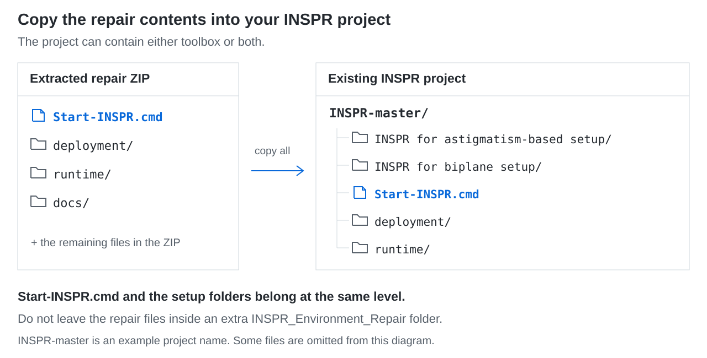
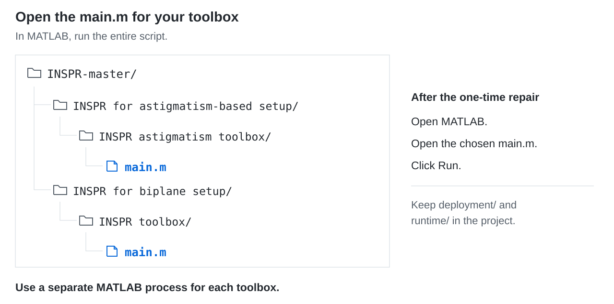

# INSPR environment repair

Set up the Windows runtime files for the INSPR astigmatism and biplane toolboxes. Start with your INSPR project, MATLAB, and NVIDIA driver installed.

**[Download](https://github.com/Tailong-Chen/INSPR-Environment-Repair/archive/refs/heads/main.zip)** · [中文说明](INSPR_Environment_Guide.md)

## 1. Download the files

1. Click **Download** above, or use **Code → Download ZIP** on this page.
2. Extract the downloaded file.
3. Open `INSPR-Environment-Repair-main`. Inside, you should see `Start-INSPR.cmd`, `deployment`, `runtime`, and the guide files.

## 2. Copy them into your INSPR project

1. Find the folder containing `INSPR for astigmatism-based setup`, `INSPR for biplane setup`, or both. This is your INSPR project root.
2. Select **all contents** of `INSPR-Environment-Repair-main` and copy them.
3. Paste them into that project root. If Windows asks, merge the folders and replace the older repair files.



Before continuing, check that your project now contains:

```text
Start-INSPR.cmd
runtime/win64/cudart64_75.dll
deployment/installers/vcredist2008_x64.exe
deployment/installers/vcredist2010_x64.exe
deployment/installers/vcredist2013_x64.exe
```

## 3. Run setup once

1. Double-click `Start-INSPR.cmd` in your INSPR project root.
2. If Windows asks to allow a Microsoft runtime installer, click **Yes**.
3. Wait for the checks to finish. MATLAB then opens INSPR. If both toolboxes are installed, select the one you want to use.

## 4. Open INSPR for daily use

1. Open MATLAB.
2. Open the `main.m` for your toolbox, following the path below.
3. Click **Run** to execute the whole script.



On later runs, start directly from this `main.m`. Keep the `deployment` and `runtime` folders with your project. To switch toolboxes, open a new MATLAB process.

## If setup stops with an error

Copy the error message and keep the files from that run in `deployment/logs`. The [English guide](INSPR_Environment_Guide_EN.md#troubleshooting) and [中文说明](INSPR_Environment_Guide.md#6-常见问题与处理) cover common errors and how to select a different MATLAB installation.
